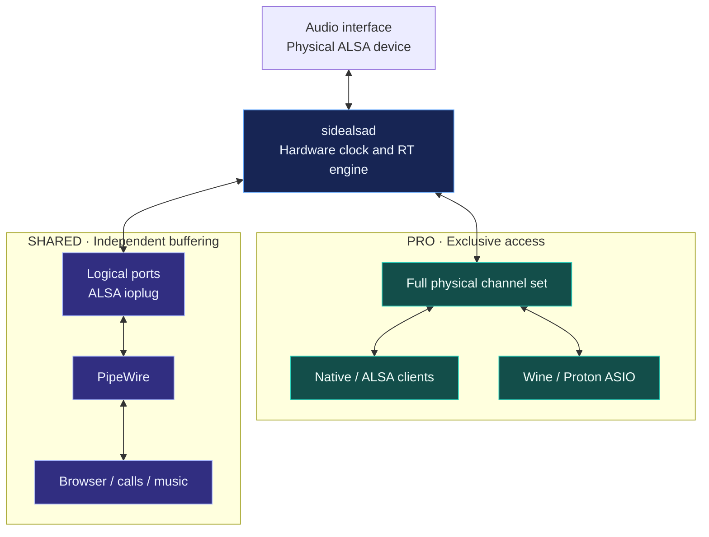

<p align="center">
  
</p>

# SideALSA

**One audio interface, with PRO for production and SHARED for desktop audio.**

SideALSA is an experimental professional-audio layer for Linux. One daemon owns the physical ALSA device and provides separate paths for DAWs and Wine ASIO, and for PipeWire desktop audio.
Its core goal is to keep the hardware streaming even when a client runs late or exits.

> [!WARNING]
> **Experimental software.** The Topping E1x2 OTG is the tested reference device.
> Small buffers and zero XRUNs do not guarantee fixed analog round-trip latency.
> Validate your own device and setup before using it for important work.

[Quick Start](#quick-start) · [Wine / Steam ASIO](#wine--steam-asio) · [Everyday Use](#everyday-use) · [Updates and Removal](#updates-and-removal) · [Technical Documentation](#technical-documentation)



PRO exposes all physical channels; SHARED exposes logical ports defined by the device profile.
Client deadline misses and actual hardware XRUNs are counted separately.
SideALSA is not a JACK replacement or a general-purpose audio graph.

## Quick Start

### 1. Requirements

Install the following tools and development packages for your distribution, then run the installer from the cloned repository.

| Purpose | Requirements |
| --- | --- |
| Core build | Current stable Rust/Cargo supporting Rust edition 2024, C and C++17 toolchains, `pkg-config`, ALSA development headers |
| Control panel | CMake, **Qt 6.5 or newer** with Widgets development files, polkit / `pkexec` |
| Service / desktop | systemd, PipeWire, WirePlumber |
| Optional ASIO | CMake, `winegcc`, `winebuild`, 64-bit Wine development headers; the host `wine` executable for prefix registration |
| Diagnostic tools | `aplay`, `arecord`, `speaker-test`, `wpctl` |
| Access | If an `audio` group exists, your desktop user must belong to it; log out and back in after joining |

The terminal menu includes both GUI and ASIO by default. You can deselect either, but on reinstalls, check whether doing so will remove an existing component.

### 2. Run the Installer

> [!IMPORTANT]
> **Run as your normal desktop user, not with `sudo`.**
> Builds run as your user. The installer requests `sudo` only for protected paths and service operations.

```bash
git clone https://github.com/square3ang/SideALSA.git
cd SideALSA
bash scripts/install.sh
```

If you already cloned the repository, run only the last command from that directory.

Running without arguments opens the terminal setup menu. Both stdin and stdout must be terminals; use explicit options for automation.

| Selection | Device / validation status |
| --- | --- |
| Supported USB device | **Topping E1x2 OTG** · `152a:8755` · verified on local hardware |
| Supported USB device | **Topping E2x2 OTG** · `152a:8756` · provisional, source-based support; not verified on local hardware |
| Manual setup | Select playback, capture, and channel counts for another ALSA device |
| Existing profile | Select a prepared TOML profile |

Supported USB selection binds the profile to the actual card's DEV0 playback and capture endpoints.
The non-OTG `152a:8752` is not selected automatically. Manual setup is available but does not guarantee device support;
hardware capabilities for channels, formats, and rates are not yet checked.
SideALSA does not aggregate independent devices, so use playback and capture sharing the same physical clock.

### 3. Confirm, Then Install

1. Select your device and profile, then review the summary.
2. Answer `y` at each `[y/N]` prompt to proceed. Enter, EOF, and any other answer cancel; nothing runs without an explicit `y`.
3. If you chose installation, review the components and final command, then answer `y` again.

> [!NOTE]
> **Supported USB devices default to installation with hardware restart.** This opens the hardware and may interrupt current audio.
> Manual setup and existing-profile selection default to **save only**; choose an installation action separately.
> To install without starting or restarting now, pick the `--no-start` action instead: it skips the running daemon
> but **still enables automatic service startup on future boots**.

After a `--no-start` installation, start the daemon later if it is not running:

```bash
sudo systemctl start sidealsad
```

If it is already running, `start` does not apply a new binary or profile. When changing an existing installation, close clients and use the menu's restart flow.
The installer and control panel leave PipeWire running. The `sidealsa-reconnect` user service automatically refreshes affected SHARED links after daemon restarts; PRO/ASIO clients still need to reconnect.
See [Installation and Service Lifecycle](docs/installation.md) and [Terminal Setup](docs/onboard-setup.md).

## Wine / Steam ASIO

The experimental **x86_64-only** ASIO frontend connects directly to PRO, bypassing the ALSA plugin and PipeWire.
Install SideALSA and ensure the daemon is running first, then run as your normal user:

```bash
bash scripts/install-asio.sh
```

1. Review the installation location, build choice, and prefix registration choice.
2. In **Steam game selection**, choose numbers using the displayed game names, AppIDs, and prefix paths.
3. In **manual Wine prefix selection**, choose a regular Wine prefix or a path from an additional Steam library.
4. Review the final summary and answer `y`.

For Steam games only, press Enter to skip the manual step. For regular Wine only, skip Steam selection.

> [!TIP]
> **Launch each Steam game with Proton once, then close it before setup.** Only existing prefixes can be selected.
> Games whose names cannot be found appear as `Unknown Steam game`.

Entering multiple numbers or `all` only selects prefixes; nothing is built, installed, or registered before the final `y` confirmation.
Registration can start Wine processes and modify the selected prefixes.

> [!CAUTION]
> **Prefixes owned by another Wine build never see system wine.** Proton
> prefixes register through `umu-run` (install `umu` first); in Bottles bottles
> the DLL is staged and `regsvr32` runs through `bottles-cli` when the wizard
> is given the bottle name, otherwise run it inside Bottles yourself
> (see [ASIO Setup Guide](docs/asio-setup.md)). `--wine`/`WINE` explicitly set
> counts as accepting responsibility.

Use the launch environment printed by the installer. If you already have launch options, merge the required environment variables rather than discarding your existing settings.
For the default installation location, Steam launch options are:

```text
WINEDLLPATH="$HOME/.local/lib/wine" %command%
```

ASIO connects to `/tmp/sidealsad.sock` unless `SIDEALSA_SOCKET` is set, so the
default setup needs no extra variable. For a custom socket or installation
location, substitute the actual paths printed by the installer. Select the SideALSA ASIO driver in your game or DAW's audio settings.
The main installer's `--with-asio` installs system files only; **prefix registration still requires this separate step**.
[ASIO Setup Guide](docs/asio-setup.md) · [ASIO Implementation and Validation](docs/milestone-asio.md)

## Everyday Use

For heavy multithreaded DSP, enable **Scheduling → Automatic PRO handoff** in the
control panel. This scales the processing budget with the period instead of
keeping a fixed 1 ms ceiling; hardware availability still bounds the deadline.
Automatic mode is enabled by default, including existing profiles that omit the setting. Explicit `pro_handoff_auto = false` keeps manual mode. See [DSP deadline measurements](docs/pro-dsp-deadlines.md).

The direct engine also automatically recovers a sustained queue-depth increase
after a hardware-worker stall, even if ALSA reports no XRUN. This is built-in
recovery, with no config switch. See [latency recovery](docs/direct-latency-recovery.md)
for the conditions, brief rebase interruption and measured results.

### Status and Control Panel

```bash
systemctl status --no-pager sidealsad.service
sidealsa-stats --samples 1
wpctl status
sidealsa-control
```

`sidealsa-control` is the Qt control panel. Applying settings authenticates, validates the profile, and restarts only the SideALSA service.
PipeWire services remain running. With `sidealsa-reconnect.service` enabled, SHARED links recover automatically without restarting apps. A brief audio gap remains; native PRO and ASIO clients must reconnect.

See [automatic SHARED recovery](docs/pipewire-reconnect.md) for activation, diagnostics and limitations.

### Select Audio in Apps

ALSA PRO applications can negotiate a one-period client buffer: with Q64,
**app B64 is supported while hardware remains B256**. Directional starts within
one logical cycle are aligned, and a capture-driven zero-prefill startup can submit in
the same cycle. Applications that prefill audio retain that buffering latency.
See [ALSA PRO buffer setup](docs/alsa-pro-buffers.md).

Choose the appropriate SideALSA port in your desktop sound settings or your app's input/output selector.
The E1x2 ports are listed below; other profiles generate ports from their own definitions.

| Purpose | ALSA PCM | PipeWire node |
| --- | --- | --- |
| Full PRO, 8 outputs / 10 inputs | `sidealsa_pro` | Not applicable |
| Stereo outputs | `sidealsa_line1` through `sidealsa_line4` | `sidealsa-line1` through `sidealsa-line4` |
| Mono inputs | `sidealsa_mic1`, `sidealsa_mic2` | `sidealsa-mic1`, `sidealsa-mic2` |
| Stereo inputs | `sidealsa_input34`, `sidealsa_input56`, `sidealsa_input78`, `sidealsa_input910` | Same names with `sidealsa-` instead of `sidealsa_` |

**PRO has only one owner.** Close the current native PRO, ALSA PRO, or ASIO app before opening another.
Compatible clients and daemons allow one input and one output from the same process and client-library instance
to share one exclusive group, including two direction-specific ASIO objects.
See [Directional PRO Opens and Limits](docs/pro-directions.md).

SHARED also permits only one backend owner per port. Different ports can run concurrently;
PipeWire mixes desktop apps sharing a port. Opening a port directly while PipeWire owns it may return `BUSY`.
`aplay -L` lists only PRO; SHARED PCMs can be opened directly by name.

### Diagnostics

```bash
sidealsa-stats --samples 100 --interval-ms 100
journalctl -u sidealsad.service -f
```

`hw_playback_xruns` / `hw_capture_xruns` count actual ALSA XRUNs.
`pro_deadline_misses` tracks PRO fallback output; `shared_underruns` / `shared_overruns` track SHARED losses.
`timeline_resets` / `generation` indicate hardware restarts or timeline rebasing.
Check SideALSA counters alongside PipeWire graph XRUNs, not just the latter.

## Updates and Removal

To refresh an existing installation without touching the device profile:

```bash
bash scripts/update.sh
```

This rebuilds and reinstalls the daemon, GUI, and ASIO while preserving the
installed profile. Previously installed features are detected from the install
manifest and repeated, and the daemon restarts unless `--no-start` is given.
`--profile`, `--replace-profile`, and `--interactive` are refused here; use
`scripts/install.sh` for device changes.

Existing installed profiles are preserved by default. Use `--profile PATH --replace-profile` to replace one explicitly.
Terminal-menu installation uses this replacement option to apply your selected profile, so check the final path.

> [!CAUTION]
> **Component selection is not additive.** Omitting `--with-asio` on a later main installation
> removes installer-managed system ASIO files. `--no-gui` removes the GUI and helper;
> `--no-pipewire` removes managed PipeWire configuration. Select the options you want to keep every time.

The PipeWire configuration creates nodes and also makes **process-wide scheduling changes**:
PipeWire/Pulse nice level `-11`, RT priority `10`, a disabled RT portal,
and WirePlumber loop priority `10`. Review [`configs/`](configs/) before installing.

Use compatible builds of the daemon, clients, ALSA plugin, and ASIO frontend together.
`--no-start` does not replace the restart required after a protocol update. If an old plugin reports `Protocol error`,
or old nodes remain after `--no-pipewire`, restart your user audio services:

```bash
systemctl --user restart pipewire.service pipewire-pulse.service wireplumber.service
```

Uninstall with `bash scripts/uninstall.sh`. Modified managed files and profiles are preserved.
It does not remove user files, prefix DLLs, or registry entries created by the separate ASIO installer.
Installation and registration are not fully transactional: completed changes may remain after a failure.
For all options, run `bash scripts/install.sh --help` or `bash scripts/install-asio.sh --help`.

## Technical Documentation

The E1x2 reference configuration is **48 kHz / S32_LE / PRO Q64 / physical P64·B256 / startup queue Q128**.
The reported 64-frame PRO software output latency excludes USB, firmware, converter, and analog latency.
Analog loopback phase changes have been observed without XRUNs; fixed latency remains unresolved.
The ALSA ioplug supports only S32_LE / RW-interleaved at the profile's sample rate. Resampling, device hotplug, arbitrary DSP, and routing graphs are out of scope.

| Topic | Documentation |
| --- | --- |
| Installation / selection menus | [Installation Details](docs/installation.md), [Device TUI](docs/onboard-setup.md), [ASIO TUI](docs/asio-setup.md) |
| Profiles / channel splits | [Device Profiles and Integration Config Generation](docs/device-profiles.md), [Profile Validation](docs/milestone-2.md), [E1x2 Profile](profiles/topping-e1x2.toml) |
| Engine / communication | [Direct ALSA Engine](docs/milestone-1.md), [Local PRO](docs/milestone-3.md), [Daemon and Protocol](docs/milestone-4.md) |
| Clients / integration | [SHARED](docs/milestone-5.md), [Client Library](docs/milestone-6.md), [ALSA ioplug](docs/milestone-7.md), [PipeWire](docs/milestone-8.md) |
| Timing / validation history | [Wine ASIO](docs/milestone-asio.md), [Startup Loopback Normalization](docs/startup-loopback.md), [Performance](docs/performance.md), [Audio Load Benchmark](docs/audio-load-benchmark.md) |

<details>
<summary>Developer builds, checks, and key installation paths</summary>

```bash
cargo build --release --workspace
cargo fmt --all -- --check
cargo clippy --workspace --all-targets -- -D warnings
cargo test --workspace
cmake -S crates/sidealsa-gui -B build-gui -DCMAKE_BUILD_TYPE=Release
cmake --build build-gui
```

The GUI is not part of the Cargo build. `--no-build` requires all selected build artifacts to exist already;
the main installer's `--with-asio --no-build` still checks for CMake, `winegcc`, and `winebuild`.
Hardware, ASIO, and loopback validation require a separate test environment. Do not run direct hardware tests while `sidealsad` owns the device.

| Item | Default path |
| --- | --- |
| Executables / socket | `/usr/local/bin` / `/tmp/sidealsad.sock` |
| Selection state / profile | `/etc/sidealsa/active.toml` / `/etc/sidealsa/profiles/<selected-profile>.toml` |
| ALSA / PipeWire configuration | `/etc/alsa/conf.d/99-sidealsa.conf` / `/etc/pipewire/pipewire.conf.d/99-sidealsa.conf` |
| User ASIO | `$HOME/.local/lib/wine` |

When the `audio` group exists, the socket is owned by `root:audio` with mode `0770`. Without that group, the installer warns and uses a socket accessible to all users.
Rust components live in [`crates/`](crates/); device-specific configurations live in [`profiles/`](profiles/).

</details>

## License

[GPL-3.0-or-later](LICENSE)
